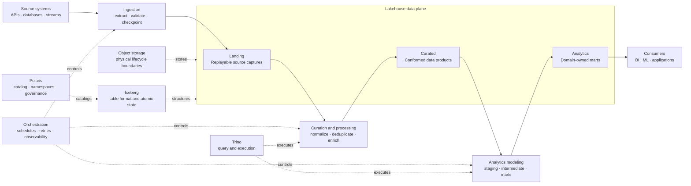

# Mini Lakehouse

A local-first, production-shaped data lakehouse built with Apache Iceberg, Apache Polaris,
Trino, dbt, Prefect, and Python managed by uv.

The project separates acquisition, conformed data products, analytics modeling, and platform
governance into explicit ownership boundaries. New sources and processors extend those boundaries
through contracts and adapters instead of introducing source-specific infrastructure.

## Architecture



Physical buckets define lifecycle, security, and retention boundaries. Polaris namespaces define
logical ownership; dbt layers remain a modeling concern inside the analytics project.

| Tier | Physical layout | Polaris namespace | Responsibility |
|---|---|---|---|
| Landing | `s3://landing/<transport>/<source>/` | `prod.landing` | Replayable source captures and checkpointed raw Iceberg tables |
| Curated | `s3://curated/<product>/` | `prod."curated.<product>"` | Validated, deduplicated, source-conformed products |
| Analytics | `s3://analytics/<domain>/` | `prod."analytics.<domain>"` | Consumer semantics, documented grains, and tested marts |

## Stack

| Component | Role |
|---|---|
| AIStor | S3-compatible storage for landing, curated, and analytics buckets |
| Apache Polaris | Iceberg REST catalog, namespaces, RBAC, and maintenance policies |
| Apache Iceberg | Atomic tables, schema evolution, partition evolution, and maintenance |
| Trino | SQL execution for curation, dbt, maintenance, and review queries |
| dbt-trino | Ephemeral staging/intermediate logic and physical analytics marts |
| Prefect | Domain-scoped scheduling, retries, observability, and notifications |
| Kaggle / Modal | Selectable adapters for quota- or cost-bound accelerator workloads |
| Streamlit | Optional read-only data-product review surfaces |
| uv + Pydantic | Reproducible Python environments and strict YAML contracts |

## Data lifecycle

```text
source system
  → replayable landing capture
  → source-conformed curated product
  → domain-owned analytics mart
  → consumer
```

- Landing owns acquisition fidelity, source checkpoints, and replay boundaries. It does not expose
  consumer semantics.
- Curated products own validation, normalization, deduplication, and the current canonical source
  state. A product may also publish immutable processing artifacts when tabular data is not enough.
- Analytics domains own business grain, measures, dimensions, tests, and downstream compatibility.
  dbt reads curated products rather than raw landing tables.
- Staging and intermediate dbt models are implementation details. Only intentional marts are
  materialized in analytics namespaces.
- Retries preserve deterministic business identities. Iceberg commits and object manifests act as
  durable publication boundaries rather than relying on orchestration state.

## Extension model

The platform grows through small, owned extension points:

1. A source contract defines acquisition metadata, landing tables, partitioning, and checkpoints.
2. A source package implements transport and parsing without owning curated business state.
3. A curated-product contract and package own canonical schemas, merge invariants, and artifacts.
4. An optional processor contract pins output semantics; a provider adapter only owns remote
   execution and delivery.
5. An analytics domain owns dbt marts and their public tests.
6. A domain-scoped Prefect flow composes these capabilities without duplicating their logic.

The idempotent platform bootstrap compiles catalog namespaces, storage locations, tables, access
grants, and maintenance policies directly from contracts. Read-only validation reports drift;
schema, partition, location, and destructive changes require an explicit migration. Runtime
endpoints and secrets remain environment configuration.

## Repository boundaries

```text
contracts/
  platform.yaml             Catalog identity and lifecycle roots
  access.yaml               Catalog grants
  maintenance.yaml          Tier retention and bounded optimization
  sources/                  Landing schemas and checkpoints
  curated/                  Canonical product schemas and keys
  domains/                  Analytics ownership and upstream products
  processors/               Stable external-processing semantics
src/mini_lakehouse/
  sources/                  Acquisition, parsing, and landing writes
  curated/                  Product-owned curation and repositories
  processing/               Provider-neutral processor protocols and execution adapters
  platform/
    catalog/                Polaris SDK, bootstrap, layout, and policy administration
    maintenance.py          Iceberg maintenance planning
    trino.py                Shared Trino execution boundary
    validate.py             Runtime readiness checks
  storage/                  S3 and Iceberg boundaries
  apps/                     Read-only operational and data-product applications
dbt/analytics/              staging → intermediate → marts
orchestration/flows/        Deployable Prefect flows grouped by domain
orchestration/plugins/      Slack and Gmail lifecycle notifications
infra/                      Service-owned bootstrap and runtime configuration
```

YAML contracts are the source of truth for non-secret platform and data-product configuration.
Runtime endpoints and credentials belong in `.env` or a secret manager.

## Quick start

Requirements:

- Docker with Compose v2
- [uv](https://docs.astral.sh/uv/)
- An AIStor license saved as the ignored root file `minio.license`

```bash
make setup
uv sync --frozen --all-extras --all-groups
make validate
make up
make platform-validate
make smoke
```

Use `make up-core` for only AIStor, Polaris, and Trino. The full stack exposes:

| Service | Local endpoint |
|---|---|
| AIStor API / Console | `localhost:9000` / `localhost:9001` |
| Polaris API / Health | `localhost:8181` / `localhost:8182` |
| Trino | `localhost:8080` |
| Prefect | `localhost:4200` |
| Optional review application | `localhost:8501` |

## Orchestration

Flow names communicate the kind of work without embedding infrastructure details:

| Prefix | Responsibility |
|---|---|---|
| `el` | Extract and land source data |
| `etl` | Extract, transform, and load one owned data product |
| `tl` | Curate existing captures or build terminal analytics outputs |
| `rpt` | Publish reports or consumer deliveries |
| `mon` | Observe data and platform health |
| `bk` | Back up recoverable state |
| `gov` | Operate governance, provider resources, and maintenance |
| `test` | Run isolated experiments or functional checks |

Schedules, parameters, and retries live with deployment definitions. A flow composes domain
services; it does not reimplement acquisition, curation, dbt, storage, or provider behavior.
Operational commands and current deployments are documented in
[pipeline operations](docs/04_pipeline_execution.md).

## Development and operations

```bash
make help                  # list supported operations
make check                 # lock, lint, type, unit, dbt parse, and Compose checks
make platform-bootstrap    # idempotently create missing or safely mutable resources
make platform-validate     # read live state and fail on managed drift
make prefect-deploy        # register all Prefect deployments
make policy-prune-plan     # inspect stale repository-managed Polaris policies
```

Integration tests are destructive and require an explicitly disposable environment:

```bash
LAKEHOUSE_ENVIRONMENT=ci \
RUN_LAKEHOUSE_INTEGRATION=1 \
uv run pytest -m integration
```

These tests run against a disposable AIStor, Polaris, and Trino data plane and verify:

- repeated platform bootstrap is idempotent and live validation reports no managed drift;
- representative source mutations converge through landing and curated products without duplicate
  business keys;
- dbt freshness, tests, and analytics marts consume only declared curated interfaces;
- repeated curation and bootstrap do not create unnecessary Iceberg snapshots.

They deliberately do not call external source/provider APIs, Prefect schedules, notification
channels, or optional review applications.

See [architecture and ownership](docs/00_overview.md),
[pipeline operations](docs/04_pipeline_execution.md), and
[contract operations](docs/06_contracts_operations.md) for deeper guidance.
