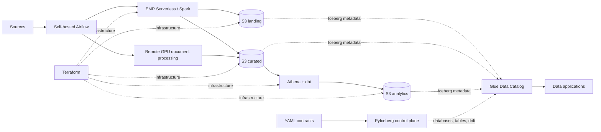

# Lakehouse Platform

A production-shaped data engineering monorepo for AWS. It separates infrastructure, catalog
contracts, source processing, orchestration, analytics, and data applications while keeping local
development simple.



## Boundaries

| Area | Owner | Responsibility |
|---|---|---|
| `infra/terraform/` | Cloud platform | S3, KMS, IAM, EMR Serverless, Athena, SSM, Secrets Manager |
| `contracts/` | Data platform and domain owners | Glue identifiers, Iceberg schema, keys, partitions, ownership |
| `src/lakehouse_platform/` | Data platform | Runtime configuration and contract-driven Glue/Iceberg control plane |
| `jobs/emr/` | Source/product teams | Spark extract, landing publication, and curated business transforms |
| `orchestration/` | Data platform | Thin Airflow DAGs that submit and monitor remote jobs |
| `dbt/analytics/` | Analytics engineering | Curated-to-analytics models and tests through Athena |
| `ocr/` | Document processing | Provider-neutral protocol, adapters, configuration, and portable GPU runtimes |
| `apps/document_inspector/` | Data application | UI plus its read-only Athena/S3 access layer |

Terraform never creates Glue databases or Iceberg tables. PyIceberg applies the YAML contracts.
Spark owns landing and curated writes. dbt owns analytics tables. Airflow does not contain business
transformations or custom AWS polling.

## Data layout

The random six-character bucket suffix is stable in Terraform state.

```text
s3://<project>-<env>-landing-<suffix>/
  <source_type>/<source>/raw/...
  <source_type>/<source>/tables/<table>/...

s3://<project>-<env>-curated-<suffix>/
  <product>/tables/<table>/...
  <product>/artifacts/<processor>/<document>/<processing-id>/...

s3://<project>-<env>-analytics-<suffix>/
  tables/<analytics database and table>/...

s3://<project>-<env>-artifacts-<suffix>/
  emr/jobs/<release>/

s3://<project>-<env>-query-results-<suffix>/
  dbt/
  document-inspector/
```

Glue database names are explicit contract fields, such as `landing_<source>`,
`curated_<product>`, and `analytics_<domain>`. These names are conventions, not runtime string
generation. EMR uses AWS-managed logs; runtime resource references live under `/lakehouse/<env>/`
in SSM Parameter Store.

## Run

Requirements: AWS credentials through the standard SDK chain, Docker Compose, Terraform, uv,
AWS CLI, and `zip`.

```bash
cp .env.example .env

# One-time remote-state bootstrap
make terraform-state-apply
export TF_STATE_BUCKET="$(terraform -chdir=infra/terraform/bootstrap/state output -raw bucket_name)"

# AWS development environment
make terraform-plan
make terraform-apply

# Configure the named workload profiles, then create the contract-owned catalog
make catalog-apply
make catalog-validate

# Build analytics, publish one immutable EMR release, and start local applications
make dbt-deps
make dbt-build
make emr-jobs-publish
make airflow-up
make document-inspector-up
```

`make emr-jobs-publish` requires a clean commit. It uploads entrypoints, locked dependencies, and
the exact contract bundle to `emr/jobs/<commit-sha>/`, then atomically updates
`/lakehouse/<env>/emr/code_uri` in SSM.

Terraform creates empty `kaggle_default` and `modal_default` Airflow connection secrets; credential
values are populated out of band. The manual `etl_mix_arxiv_document_ocr` DAG requires one exact
`arxiv_id` and one provider. A run downloads its PDF only inside the remote temporary workspace,
publishes validated OCR artifacts to curated S3, and commits one Iceberg run row last.

Kaggle runner source is a release asset, not a per-document payload. Run
`make ocr-kaggle-runner-publish` only when runner code or its lockfile changes, then pin the
published Dataset version in the OCR configuration. Each document run submits only its validated
job and a small launcher; provider SDKs own remote execution and log streaming.

## Add a source

1. Add `contracts/sources/<source>.yaml` and, when needed,
   `contracts/curated/<product>.yaml`.
2. Apply contracts before any data job writes.
3. Add source logic under `jobs/emr/src/lakehouse_jobs/<source>/` and a thin adapter under
   `jobs/emr/entrypoints/`.
4. Add a thin DAG under `orchestration/dags/<domain>/` named
   `[job_type]_[worker_type]_[description].py`.
5. Add contract, idempotency, and business-logic tests.

Shared runtime code resolves schema, table identifiers, and raw storage prefixes from the published
contract bundle. A source job should contain only source protocol parsing and product-specific
transformation logic.

## Quality

```bash
make platform-validate
make lint
make test
make check
```

No static AWS key belongs in `.env`, Compose, contracts, Terraform state, or Airflow metadata.
Local processes use named AWS profiles; deployed workloads use scoped IAM roles.
