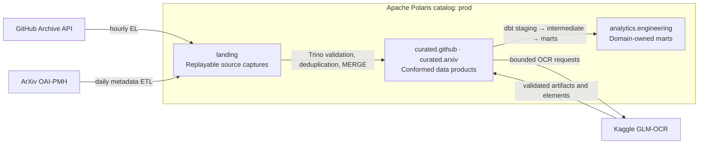
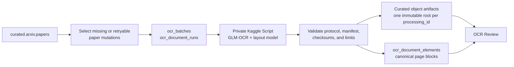

# Mini Lakehouse

A local-first, production-shaped data lakehouse built with Apache Iceberg, Apache Polaris,
Trino, dbt, Prefect, and Python managed by uv.

It ingests GitHub Archive and ArXiv data, publishes source-conformed curated products, and builds
consumer-facing analytics marts with explicit ownership and replay-safe pipelines.

## Architecture



Physical buckets define lifecycle, security, and retention boundaries. Polaris namespaces define
logical ownership; dbt layers remain a modeling concern inside the analytics project.

| Tier | Physical layout | Polaris namespace | Responsibility |
|---|---|---|---|
| Landing | `s3://landing/<transport>/<source>/` | `prod.landing` | Immutable source responses and checkpointed raw Iceberg tables |
| Curated | `s3://curated/<product>/` | `prod."curated.<product>"` | Validated, deduplicated, source-conformed products |
| Analytics | `s3://analytics/<domain>/` | `prod."analytics.<domain>"` | Consumer semantics, documented grains, and tested marts |

## Stack

| Component | Role |
|---|---|
| AIStor | S3-compatible storage for landing, curated, and analytics buckets |
| Apache Polaris | Iceberg REST catalog, namespaces, RBAC, and policy desired state |
| Apache Iceberg | Atomic tables, schema evolution, partition evolution, and maintenance |
| Trino | SQL execution for curation, dbt, maintenance, and review queries |
| dbt-trino | Ephemeral staging/intermediate logic and physical analytics marts |
| Prefect | Domain-scoped scheduling, retries, observability, and notifications |
| Kaggle | Quota-bound GPU execution for GLM-OCR |
| Streamlit | Read-only OCR result review |
| uv + Pydantic | Reproducible Python environments and strict YAML contracts |

## Data modeling

GitHub Archive follows the complete path:

```text
prod.landing.github_archive_events_raw
  → prod."curated.github".{events, actors_current, repositories_current}
  → prod."analytics.engineering".{fct_repository_activity_daily,
                                   fct_contributor_activity_daily}
```

dbt reads curated products—not landing tables. `staging` and `intermediate` models are ephemeral;
only domain marts are materialized in analytics. ArXiv curation owns current paper metadata,
authors, categories, OCR lineage, immutable artifacts, and canonical page elements.

## OCR pipeline



Each request is identified by the paper, source mutation, and processor configuration. Successful
content is identified independently by PDF hash, pinned model revisions, adapter version, and
configuration. This separates retry identity from reusable processing identity.

- Kaggle downloads source PDFs inside the job; PDFs are not persisted in the lakehouse.
- A batch contains at most two documents. Typed retryable failures are attempted up to three times.
- Validated outputs contain per-page Markdown, canonical elements, layout visualizations, and a
  content manifest below
  `s3://curated/arxiv/ocr/papers/<arxiv-id>/<processing-id>/`.
- The manifest is the object-store commit marker. Iceberg lineage and elements are published only
  after validation, and repeated imports converge on the same processing identity.
- OCR Review reads Iceberg lineage plus verified immutable artifacts; it does not infer bucket keys.

## Repository boundaries

```text
contracts/                  Non-secret desired state: catalog, sources, products, domains, policies
src/mini_lakehouse/
  sources/                  Acquisition, parsing, and landing writes
  curated_products/         Product-owned curation and repositories
  processing/ocr/           Provider-neutral OCR protocol and Kaggle adapter
  platform/                 Polaris, Trino, access, reconciliation, and maintenance
  storage/                  S3 and Iceberg boundaries
dbt/analytics/              staging → intermediate → marts
orchestration/flows/        Deployable Prefect flows grouped by domain
orchestration/plugins/      Slack and Gmail lifecycle notifications
infra/                      Service-owned bootstrap and runtime configuration
```

YAML contracts are the source of truth for non-secret platform and data-product configuration.
Runtime endpoints and credentials belong in `.env` or a secret manager.

## Quick start

Requirements:

- Docker with Compose v2
- [uv](https://docs.astral.sh/uv/)
- An AIStor license saved as the ignored root file `minio.license`

```bash
make setup
uv sync --frozen --all-extras --all-groups
make validate
make up
make smoke
```

Use `make up-core` for only AIStor, Polaris, and Trino. The full stack exposes:

| Service | Local endpoint |
|---|---|
| AIStor API / Console | `localhost:9000` / `localhost:9001` |
| Polaris API / Health | `localhost:8181` / `localhost:8182` |
| Trino | `localhost:8080` |
| Prefect | `localhost:4200` |
| OCR Review | `localhost:8501` |

## Pipelines

| Deployment | Schedule (UTC) | Purpose |
|---|---|---|
| `el_github_archive` | Hourly at `:15` | Land one complete GitHub Archive hour |
| `tl_github_analytics` | Hourly at `:30` | Curate the hour, validate freshness, and build dbt marts |
| `etl_arxiv_metadata` | Daily at `06:00` | Harvest and curate the closed ArXiv datestamp day |
| `etl_arxiv_ocr` | Every 20 minutes, paused | Reconcile one bounded GPU OCR batch |
| `gov_iceberg_maintenance` | Sunday at `03:00` | Apply tier-specific Iceberg maintenance policies |

Before OCR, configure `LAKEHOUSE_KAGGLE__USERNAME` and
`LAKEHOUSE_KAGGLE__API_TOKEN`, then run:

```bash
uv run prefect deployment run \
  gov_arxiv_ocr_resources/gov_arxiv_ocr_resources
```

Runner datasets are private and content-addressed. The same runner content reconciles without
uploading again; a changed bundle publishes a new immutable dataset. Model resources are pinned by
revision and independently reconciled.

## Development and operations

```bash
make help                  # list supported operations
make check                 # lock, lint, type, unit, dbt parse, and Compose checks
make platform-reconcile    # reconcile catalog, namespaces, access, and policies
make prefect-deploy        # register all Prefect deployments
make policy-prune-plan     # inspect stale repository-managed Polaris policies
```

Integration tests are destructive and require an explicitly disposable environment:

```bash
LAKEHOUSE_ENVIRONMENT=ci \
RUN_LAKEHOUSE_INTEGRATION=1 \
uv run pytest -m integration
```

See [architecture and ownership](docs/00_overview.md),
[pipeline operations](docs/04_pipeline_execution.md), and
[contract operations](docs/06_contracts_operations.md) for deeper guidance.
