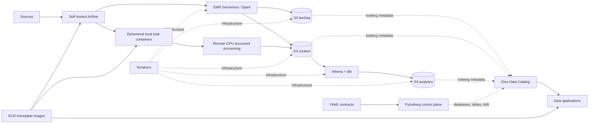

# Lakehouse Platform

A production-shaped data engineering monorepo for AWS. It separates infrastructure, catalog
contracts, source processing, orchestration, analytics, and data applications while keeping local
development simple.



## Boundaries

| Area | Owner | Responsibility |
|---|---|---|
| `infra/terraform/` | Cloud platform | S3, ECR, KMS, IAM, EMR Serverless, Athena, SSM, Secrets Manager |
| `platform/` | Data platform | YAML contracts and the contract-driven Glue/Iceberg control plane |
| `jobs/emr/` | Source/product teams | Spark extract, landing publication, and curated business transforms |
| `orchestration/` | Data platform | Thin Airflow DAGs that submit EMR jobs or run isolated task images |
| `dbt/analytics/` | Analytics engineering | Curated-to-analytics models and tests through Athena |
| `ocr/` | Document processing | Provider-neutral protocol, adapters, configuration, and portable GPU runtimes |
| `apps/arxiv_inspector/` | Data application | UI plus its read-only Athena/S3 access layer |

Terraform never creates Glue databases or Iceberg tables. PyIceberg applies the YAML contracts.
Spark owns landing and curated writes. dbt owns analytics tables. Airflow does not contain business
transformations or custom AWS polling.

Each deployable domain owns its package metadata and runtime dependencies. Platform, OCR,
ArXiv Inspector, and analytics share the root workspace where appropriate; Airflow, EMR, and
the remote OCR runner keep independent lockfiles because their runtime constraints differ.

## Data layout

The random six-character bucket suffix is stable in Terraform state.

```text
s3://<project>-<env>-landing-<suffix>/
  <source_type>/<source>/raw/...
  <source_type>/<source>/tables/<table>/...

s3://<project>-<env>-curated-<suffix>/
  <product>/tables/<table>/...
  <product>/artifacts/<processor>/<document>/<processing-id>/...

s3://<project>-<env>-analytics-<suffix>/
  tables/<analytics database and table>/...

s3://<project>-<env>-artifacts-<suffix>/
  emr/jobs/<release>/

s3://<project>-<env>-query-results-<suffix>/
  dbt/
  arxiv-inspector/
```

Glue database names are explicit contract fields, such as `landing_<source>`,
`curated_<product>`, and `analytics_<domain>`. These names are conventions, not runtime string
generation. EMR uses AWS-managed logs; runtime resource references live under `/lakehouse/<env>/`
in SSM Parameter Store.

## Run

Requirements: AWS credentials through the standard SDK chain, Docker Compose, Terraform, uv, and
the AWS CLI.

```bash
# One-time remote-state bootstrap
make terraform-state-apply
export TF_STATE_BUCKET="$(terraform -chdir=infra/terraform/bootstrap/state output -raw bucket_name)"

# AWS development environment
make terraform-plan
make terraform-apply
AWS_PROFILE=your-terraform-admin make airflow-bootstrap-init

# Configure the default lakehouse-dev-* assume-role profiles, then create the catalog
make catalog-apply
make catalog-validate

# Build analytics and publish immutable EMR and service releases
make dbt-deps
make dbt-build
make emr-jobs-publish
make ecr-publish

# Pull that exact commit from ECR and run the services locally
make ecr-deploy
```

`make emr-jobs-publish` requires a clean commit. It uploads entrypoints, locked dependencies, and
the exact contract bundle to `emr/jobs/<commit-sha>/`, then atomically updates
`/lakehouse/<env>/emr/code_uri` in SSM.

`make ecr-publish` builds the Airflow, ArXiv Inspector, and OCR worker images once and
publishes them to separate immutable ECR repositories using the committed Git SHA as the tag.
`make ecr-deploy` pre-pulls that same release, points the stable local OCR worker alias at its
exact immutable image, and starts local Compose without rebuilding. DAG source is packaged in the
Airflow image; it is not bind-mounted from the worktree. For local image iteration, run
`make images-build` followed by `make services-up`.

Terraform creates separate OCR provider secrets and Airflow notification connection secrets;
credential values are populated out of band. It also creates one domain-level Airflow bootstrap
secret containing the metadata database password, Fernet key, and JWT secret. `make airflow-up`
reads that secret without mutating it and mounts the values as service-scoped Compose secrets.

The manual `etl_docker_arxiv_document_ocr` DAG requires one exact `arxiv_id` and one provider.
Airflow starts the pinned OCR worker image through `DockerOperator`; that container submits the
remote GPU run, streams its logs, publishes validated artifacts to curated S3, and commits one
Iceberg run row last. OCR libraries and provider SDKs are not installed in Airflow.

Kaggle runner source is a release asset, not a per-document payload. Run
`make ocr-kaggle-runner-publish` only when runner code or its lockfile changes, then pin the
published Dataset version in the OCR configuration. Each document run submits only its validated
job and a small launcher; provider SDKs own remote execution and log streaming.

## Add a source

1. Add `platform/contracts/sources/<source>.yaml` and, when needed,
   `platform/contracts/curated/<product>.yaml`.
2. Apply contracts before any data job writes.
3. Add source logic under `jobs/emr/src/emr_jobs/<source>/` and a thin adapter under
   `jobs/emr/entrypoints/`.
4. Add a thin DAG under `orchestration/dags/<domain>/` named
   `[job_type]_[worker_type]_[description].py`.
5. Add contract, idempotency, and business-logic tests.

Shared runtime code resolves schema, table identifiers, and raw storage prefixes from the published
contract bundle. A source job should contain only source protocol parsing and product-specific
transformation logic.

## Quality

```bash
make platform-validate
make lint
make test
make check
```

The repository does not use `.env` files. Secret values belong in Secrets Manager, runtime resource
references belong in Parameter Store, and stable local defaults live in the Makefile/Compose
boundary. Local processes use named AWS profiles; deployed workloads use scoped IAM roles. Override
a default only at the command boundary, for example
`EMR_DEPLOYER_AWS_PROFILE=custom-profile make emr-jobs-publish`.
