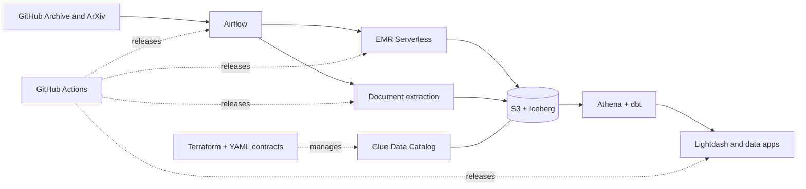

# Mini Lakehouse

Mini Lakehouse is a production-shaped, open-source data platform for learning from and running a
modern lakehouse without hiding the operational details. It combines an AWS data plane with a
small self-hosted OCI runtime and keeps infrastructure, data contracts, processing, analytics, and
applications independently deployable.

The included reference workloads ingest GitHub Archive and ArXiv data, extract PDF content, build
Iceberg tables and dbt models, and expose the results through Lightdash and a Streamlit inspector.

## What is included

- Infrastructure as code for AWS, OCI, Tailscale, Cloudflare, and GitHub Actions.
- Contract-driven Glue and Apache Iceberg catalogs defined in YAML.
- Spark ingestion and transformation on EMR Serverless.
- Self-hosted Airflow with versioned DAG bundles and isolated task images.
- CPU-native PDF extraction with OpenDataLoader and optional remote GLM-OCR GPU runners.
- Athena and dbt analytics projects for engineering and research datasets.
- Self-hosted Lightdash and a read-only ArXiv inspection application.
- Immutable image and job releases, workload-scoped identities, and reproducible local checks.

## Architecture



AWS owns the durable data plane. A private OCI A1 host runs Airflow, PostgreSQL, Lightdash, and the
application services behind Tailscale and Cloudflare Access. GPU OCR is optional and remote; the
default OpenDataLoader pipeline runs on CPU.

## Repository layout

| Path | Purpose |
|---|---|
| `platform/` | YAML data contracts and the PyIceberg catalog control plane |
| `jobs/emr/` | Spark source ingestion and curated transformations |
| `orchestration/` | Airflow runtime, DAG bundle, and deployment |
| `ocr/` | Provider-neutral document extraction and remote runners |
| `dbt/` | Athena analytics models and their shared runtime |
| `lightdash/` | Domain-owned BI content and its protected delivery control plane |
| `apps/` | Application code and self-hosted service runtime boundaries |
| `infra/` | Terraform, shared services, delivery, and operations |

Ownership follows these boundaries: Terraform provisions infrastructure, YAML contracts own the
catalog, Spark and OCR own curated data, dbt owns analytics tables, Lightdash owns BI semantics and
content, application deploy folders own runtimes, and Airflow only orchestrates.

## Getting started

Explore the available development and operations commands:

```bash
make help
```

Run the complete local quality gate before submitting a change:

```bash
make check
```

The canonical deployment and operations guide is [infra/README.md](infra/README.md). It covers the
bootstrap order, cloud resources, workload identities, secrets, releases, verification, and
day-two operations. Stable configuration lives in Make, Compose, Terraform, or YAML—not `.env`
files.

## Contributing

Issues, documentation improvements, new sources, and focused pull requests are welcome. Keep
changes within the owning component, add tests for behavior and contracts, run `make check`, and
never commit credentials or generated cloud state.

## License

Licensed under the [Apache License 2.0](LICENSE).
