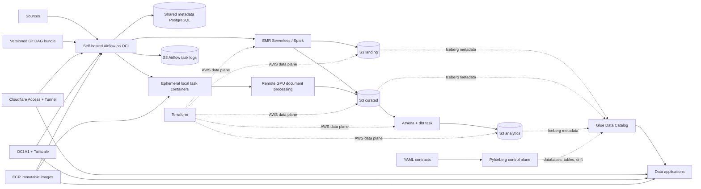

# Lakehouse Platform

A production-shaped data engineering monorepo using AWS data services and a private OCI services
host. It separates infrastructure, catalog contracts, source processing, orchestration, analytics,
and data applications while keeping local development simple.



## Boundaries

| Area | Owner | Responsibility |
|---|---|---|
| `infra/terraform/aws/` | AWS platform | S3, ECR, KMS, IAM, EMR Serverless, SSM, Secrets Manager |
| `infra/terraform/oci/` | Runtime platform | Rebuildable ARM services host with no public ingress |
| `infra/terraform/tailscale/` | Network platform | Private grants, SSH policy, and enrollment |
| `infra/terraform/github/` | Delivery platform | Protected environments, deployment policy, and release variables |
| `infra/terraform/cloudflare/` | Edge platform | Tunnel, public DNS, and identity-aware application access |
| `infra/runtime/cloudflare/` | Runtime platform | Pinned outbound connector and secret materialization |
| `infra/runtime/postgres/` | Runtime platform | Shared PostgreSQL server with isolated application databases |
| `platform/` | Data platform | YAML contracts and the contract-driven Glue/Iceberg control plane |
| `jobs/emr/` | Source/product teams | Spark extract, landing publication, and curated business transforms |
| `orchestration/bundle/` | Workflow definitions | Versionable Airflow DAGs and DAG-only support code |
| `orchestration/runtime/` | Runtime platform | Airflow image, providers, and runtime integrations |
| `orchestration/deploy/` | Runtime platform | Self-hosted Airflow deployment definition |
| `dbt/analytics/` | Analytics engineering | Isolated curated-to-analytics task image, models, and tests through Athena |
| `ocr/` | Document processing | Provider-neutral protocol, adapters, configuration, and portable GPU runtimes |
| `apps/arxiv_inspector/` | Data application | UI plus its read-only Athena/S3 access layer |

Terraform never creates Glue databases or Iceberg tables. PyIceberg applies the YAML contracts.
Spark owns source-to-landing and source-to-curated writes; the isolated OCR worker owns its curated
OCR tables through PyIceberg. dbt owns analytics tables. Airflow contains only orchestration.

Each deployable domain owns its Dockerfile and runtime dependencies. Airflow, dbt, EMR, and the
remote OCR runner keep independent lockfiles because their runtimes differ. The root workspace is
limited to the compatible platform, OCR, and ArXiv Inspector packages.

## Data layout

Each environment owns explicit globally unique bucket names; Terraform never regenerates suffixes.

```text
s3://<project>-<env>-landing-<suffix>/
  <source_type>/<source>/raw/...
  <source_type>/<source>/tables/<table>/...

s3://<project>-<env>-curated-<suffix>/
  <product>/tables/<table>/...
  <product>/artifacts/<processor>/<document>/<processing-id>/...

s3://<project>-<env>-analytics-<suffix>/
  tables/<analytics database and table>/...

s3://<project>-<env>-artifacts-<suffix>/
  emr/jobs/<release>/

s3://<project>-<env>-logs-<suffix>/
  airflow/task-logs/                  # 30-day dev retention

s3://<project>-<env>-query-results-<suffix>/
  dbt/
  arxiv-inspector/
```

Glue database names are explicit contract fields, such as `landing_<source>`,
`curated_<product>`, and `analytics_<domain>`. These names are conventions, not runtime string
generation. EMR uses AWS-managed logs; runtime resource references live under `/lakehouse/<env>/`
in SSM Parameter Store. Airflow's remote-log URI is resolved from SSM instead of being embedded in
Compose. Immutable service releases stay in ECR and are deployed independently by digest; SSM does
not duplicate Git-owned image versions.

## Workflows

Run the complete local quality gate before publishing a change:

```bash
make check
```

The canonical first-deployment and day-two runbook is [infra/README.md](infra/README.md). It covers
the one-time state bootstrap, AWS, Tailscale, GitHub, OCI, workload identities, runtime secrets,
catalog contracts, initial releases, and verification in dependency order. Use the Make targets in
that runbook instead of running Terraform from the repository root; they keep provider data and
state outside the worktree.

For unpublished workstation iteration only:

```bash
make images-build
make airflow-up
make arxiv-inspector-up
```

## Delivery

The GitHub Terraform root reads the applied AWS and Tailscale remote states, creates the protected
`dev` environment, restricts deployments to `main`, requires owner approval, and writes its six
non-secret release variables. Its API token stays in the provider credential chain and never enters
Terraform configuration or state. Pull requests only validate; a reviewed merge publishes only
affected images or EMR artifacts. GitHub exchanges OIDC tokens for short-lived AWS and Tailscale
credentials, so CI stores no AWS key, Tailscale OAuth secret, or SSH key.

The one-time backend bootstrap keeps its small local state at
`~/.cache/lakehouse/terraform/state/aws-bootstrap.tfstate`; this is the unavoidable state needed to
create the state bucket itself. AWS, Tailscale, GitHub, OCI, and Cloudflare then use isolated,
natively locked keys in that versioned S3 bucket. OCI consumes the single-use Tailscale enrollment key directly
from the Tailscale state, so it is never copied through a shell variable or tfvars file.

The EMR release workflow uploads entrypoints, locked dependencies, and the exact contract bundle to
`emr/jobs/<commit-sha>/`. A checksum manifest marks a complete release; only then does CI atomically
update `/lakehouse/<env>/emr/code_uri` in SSM. Rerunning a completed revision reuses it, while a
failed partial upload can be repaired before the completion marker is written.

Each component workflow builds one multi-architecture image under an immutable Git-SHA tag, records
provenance/SBOM, and deploys its digest through a port-22-only Tailscale identity. Deployments are
serialized per component; reruns reuse the existing immutable image. Component rollback verifies
that the digest belongs to its reviewed Git revision, and EMR rollback restores only a completed
reviewed release. Airflow, Inspector, dbt, and OCR cannot accidentally move together, and the OCI
host never reads Terraform state. CI streams only the selected component-owned deployment bundle;
the host does not clone the repository or run its root Makefile.
Airflow reconciliation also brings up its metadata PostgreSQL dependency before migrating Airflow.
The Cloudflare connector is the exception: a protected manual workflow deploys the pinned upstream
multi-architecture digest directly, without a custom image or ECR repository.

Airflow uses the official versioned `GitDagBundle` and tracks the reviewed `main` ref under
`orchestration/bundle`. A DAG-only merge is fetched by the DAG processor without rebuilding or
restarting Airflow; active and retried runs retain their original Git commit by default. The
Airflow image contains providers and runtime integrations only. Changing bundle code to require a
new provider still requires a compatible runtime image release first.

Terraform creates secret containers but never secret values. Shared PostgreSQL bootstrap, the
Airflow database owner, and the Airflow runtime each have a separate secret boundary. PostgreSQL is
deployed independently and owns only storage/availability; Airflow owns its database migrations.
`make airflow-up` materializes only the Airflow database and runtime values as service-scoped Compose
secrets; SimpleAuthManager never generates or logs a password.
The Cloudflare Tunnel token is synchronized explicitly into its AWS secret container and exposed to
the connector only as a read-only file; the Cloudflare API token remains an operator credential.

Producer tasks emit centrally declared logical assets only after successful completion. The GitHub
curated asset triggers the dbt task DAG, which runs source freshness before `dbt build`; ArXiv
metadata, OCR, and engineering analytics expose separate lineage assets. Shared operator factories
own Docker and EMR lifecycle defaults. The weekly maintenance DAG compacts only recent partitions,
expires snapshots, and removes sufficiently old orphan files. Catalog validation reports stale
objects carrying platform ownership but never drops them.

The manual `etl_docker_arxiv_document_ocr` DAG requires one non-empty `arxiv_id` and one provider.
Airflow starts the pinned OCR worker image through `DockerOperator`; that container submits the
remote GPU run, streams its logs, publishes validated artifacts to curated S3, and commits one
Iceberg run row last. OCR libraries and provider SDKs are not installed in Airflow.

Kaggle runner source is a release asset, not a per-document payload. Run
`make ocr-kaggle-runner-publish` only when runner code or its lockfile changes, then pin the
published Dataset version in the OCR configuration. Each document run submits only its validated
job and a small launcher; provider SDKs own remote execution and log streaming.

## Add a source

1. Add `platform/contracts/sources/<source>.yaml` and, when needed,
   `platform/contracts/curated/<product>.yaml`.
2. Apply contracts before any data job writes.
3. Add source logic under `jobs/emr/src/emr_jobs/<source>/` and a thin adapter under
   `jobs/emr/entrypoints/`.
4. Add a thin DAG under `orchestration/bundle/dags/<domain>/` named
   `[job_type]_[worker_type]_[description].py`.
5. Add contract, idempotency, and business-logic tests.

Shared runtime code resolves schema, table identifiers, and raw storage prefixes from the published
contract bundle. A source job should contain only source protocol parsing and product-specific
transformation logic.

ArXiv landing publication uses deterministic day paths and partition overwrite. Replaying a day
replaces that authoritative landing partition before the latest mutations are merged into curated.

The repository does not use `.env` files. Secret values belong in Secrets Manager, runtime resource
references belong in Parameter Store, and stable defaults live in the Makefile/Compose boundary.
Local operator commands use the standard AWS credential chain, GitHub uses environment-scoped OIDC,
and OCI workloads use isolated certificate-backed temporary credentials. Select a local profile at
the command boundary with standard `AWS_PROFILE`; repository-specific profile variables do not
exist.
