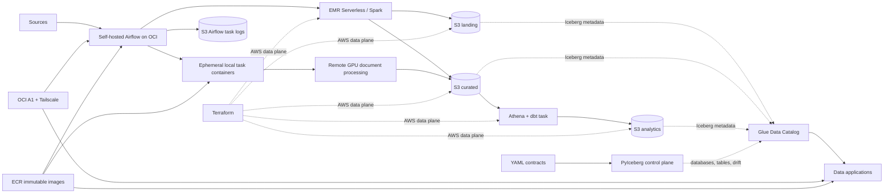

# Lakehouse Platform

A production-shaped data engineering monorepo using AWS data services and a private OCI services
host. It separates infrastructure, catalog contracts, source processing, orchestration, analytics,
and data applications while keeping local development simple.



## Boundaries

| Area | Owner | Responsibility |
|---|---|---|
| `infra/terraform/aws/` | AWS platform | S3, ECR, KMS, IAM, EMR Serverless, SSM, Secrets Manager |
| `infra/terraform/oci/` | Runtime platform | Rebuildable ARM services host with no public ingress |
| `infra/terraform/tailscale/` | Network platform | Private grants, SSH policy, and enrollment |
| `platform/` | Data platform | YAML contracts and the contract-driven Glue/Iceberg control plane |
| `jobs/emr/` | Source/product teams | Spark extract, landing publication, and curated business transforms |
| `orchestration/` | Data platform | Thin Airflow DAGs that submit EMR jobs or run isolated task images |
| `dbt/analytics/` | Analytics engineering | Isolated curated-to-analytics task image, models, and tests through Athena |
| `ocr/` | Document processing | Provider-neutral protocol, adapters, configuration, and portable GPU runtimes |
| `apps/arxiv_inspector/` | Data application | UI plus its read-only Athena/S3 access layer |

Terraform never creates Glue databases or Iceberg tables. PyIceberg applies the YAML contracts.
Spark owns source-to-landing and source-to-curated writes; the isolated OCR worker owns its curated
OCR tables through PyIceberg. dbt owns analytics tables. Airflow contains only orchestration.

Each deployable domain owns its Dockerfile and runtime dependencies. Airflow, dbt, EMR, and the
remote OCR runner keep independent lockfiles because their runtimes differ. The root workspace is
limited to the compatible platform, OCR, and ArXiv Inspector packages.

## Data layout

Each environment owns explicit globally unique bucket names; Terraform never regenerates suffixes.

```text
s3://<project>-<env>-landing-<suffix>/
  <source_type>/<source>/raw/...
  <source_type>/<source>/tables/<table>/...

s3://<project>-<env>-curated-<suffix>/
  <product>/tables/<table>/...
  <product>/artifacts/<processor>/<document>/<processing-id>/...

s3://<project>-<env>-analytics-<suffix>/
  tables/<analytics database and table>/...

s3://<project>-<env>-artifacts-<suffix>/
  emr/jobs/<release>/

s3://<project>-<env>-logs-<suffix>/
  airflow/task-logs/                  # 30-day dev retention

s3://<project>-<env>-query-results-<suffix>/
  dbt/
  arxiv-inspector/
```

Glue database names are explicit contract fields, such as `landing_<source>`,
`curated_<product>`, and `analytics_<domain>`. These names are conventions, not runtime string
generation. EMR uses AWS-managed logs; runtime resource references live under `/lakehouse/<env>/`
in SSM Parameter Store. Airflow's remote-log URI and the published service release manifest are
also resolved from SSM instead of being embedded in Compose.

## Run

Requirements: Docker Compose, Terraform, uv, AWS CLI, OCI CLI/config, and scoped Tailscale OAuth
credentials.
Use the Make targets below rather than running `terraform init` from the repository root; they keep
Terraform working data in a shared cache outside the worktree and discover the state bucket
automatically.

```bash
# One-time remote-state bootstrap
make aws-state-apply

# AWS development environment and temporary external workload identities
make workload-pki-init
make aws-plan
make aws-apply
make workload-identities-render
AWS_PROFILE=your-terraform-admin make airflow-bootstrap-init

# Private network and OCI services host (after copying the documented tfvars examples)
make tailscale-plan
make tailscale-apply
export TF_VAR_tailscale_auth_key="$(make --no-print-directory tailscale-auth-key)"
make oci-plan
make oci-apply
unset TF_VAR_tailscale_auth_key
make workload-identities-install

# Configure the operator assume-role profiles, then create the catalog
make catalog-apply
make catalog-validate

# Build analytics locally and publish immutable EMR and service releases
make dbt-deps
make dbt-build
make emr-jobs-publish
make images-publish

# On the enrolled services host, pull that exact commit and bind only to Tailscale
make release-deploy
```

`make emr-jobs-publish` requires a clean commit. It uploads entrypoints, locked dependencies, and
the exact contract bundle to `emr/jobs/<commit-sha>/`, then atomically updates
`/lakehouse/<env>/emr/code_uri` in SSM.

`make images-publish` builds multi-architecture Airflow, dbt task, ArXiv Inspector, and OCR worker
images, publishes every immutable Git-SHA tag, and then updates one release manifest in SSM.
`make release-deploy` pulls the complete manifest, waits for both Compose projects to become
healthy, updates local dbt/OCR aliases last, and restores the previous healthy images on failure.
The OCI host does not read Terraform state during deployment. DAG source
and its locked providers are packaged together in the Airflow image; the worktree is never mounted.

Terraform creates separate OCR provider secrets and Airflow notification connection secrets;
credential values are populated out of band. It also creates one domain-level Airflow bootstrap
secret containing the metadata database password, Fernet key, JWT secret, and UI administrator
password. `make airflow-up` reads that secret without mutating it and mounts the values as
service-scoped Compose secrets; SimpleAuthManager never generates or logs a password.

Producer tasks emit centrally declared logical assets only after successful completion. The GitHub
curated asset triggers the dbt task DAG, which runs source freshness before `dbt build`; ArXiv
metadata, OCR, and engineering analytics expose separate lineage assets. Shared operator factories
own Docker and EMR lifecycle defaults. The weekly maintenance DAG compacts only recent partitions,
expires snapshots, and removes sufficiently old orphan files. Catalog validation reports stale
objects carrying platform ownership but never drops them.

The manual `etl_docker_arxiv_document_ocr` DAG requires one non-empty `arxiv_id` and one provider.
Airflow starts the pinned OCR worker image through `DockerOperator`; that container submits the
remote GPU run, streams its logs, publishes validated artifacts to curated S3, and commits one
Iceberg run row last. OCR libraries and provider SDKs are not installed in Airflow.

Kaggle runner source is a release asset, not a per-document payload. Run
`make ocr-kaggle-runner-publish` only when runner code or its lockfile changes, then pin the
published Dataset version in the OCR configuration. Each document run submits only its validated
job and a small launcher; provider SDKs own remote execution and log streaming.

## Add a source

1. Add `platform/contracts/sources/<source>.yaml` and, when needed,
   `platform/contracts/curated/<product>.yaml`.
2. Apply contracts before any data job writes.
3. Add source logic under `jobs/emr/src/emr_jobs/<source>/` and a thin adapter under
   `jobs/emr/entrypoints/`.
4. Add a thin DAG under `orchestration/dags/<domain>/` named
   `[job_type]_[worker_type]_[description].py`.
5. Add contract, idempotency, and business-logic tests.

Shared runtime code resolves schema, table identifiers, and raw storage prefixes from the published
contract bundle. A source job should contain only source protocol parsing and product-specific
transformation logic.

ArXiv landing publication uses deterministic day paths and partition overwrite. Replaying a day
replaces that authoritative landing partition before the latest mutations are merged into curated.

## Quality

```bash
make platform-validate
make lint
make test
make check
```

The repository does not use `.env` files. Secret values belong in Secrets Manager, runtime resource
references belong in Parameter Store, and stable defaults live in the Makefile/Compose boundary.
Human and CI publishing commands use named operator profiles; OCI workloads and local workload
tests use isolated certificate-backed temporary credentials. Override an operator profile only at
the command boundary, for example
`EMR_DEPLOYER_AWS_PROFILE=custom-profile make emr-jobs-publish`.
