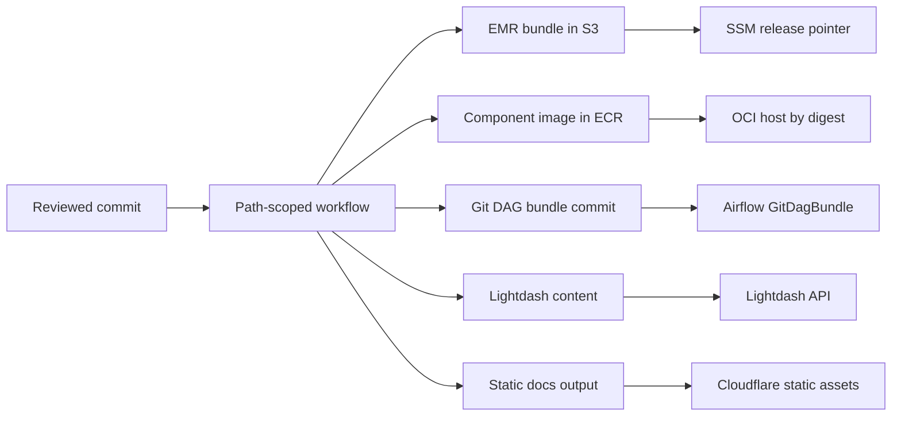

Every artifact has one publisher and one deployment boundary.

## Release rules

- No image uses `latest`; deployed images are resolved to immutable digests.
- EMR jobs are uploaded under the Git commit, completed by a checksum manifest, then exposed through
  one SSM pointer.
- DAG-only changes are fetched through Airflow's versioned `GitDagBundle`; they do not rebuild the
  Airflow runtime image.
- dbt and Lightdash are under one Analytics ownership boundary but retain separate deployments.
- OCR has no ECR repository or OCI deployment; Modal owns the remote GPU app.
- Documentation builds to `docs/out` and deploys without a container or service host.

Rollback selects a previously verified immutable image digest or EMR revision. DAG renames and
directory refactors are direct cutovers; compatibility aliases are not retained.
