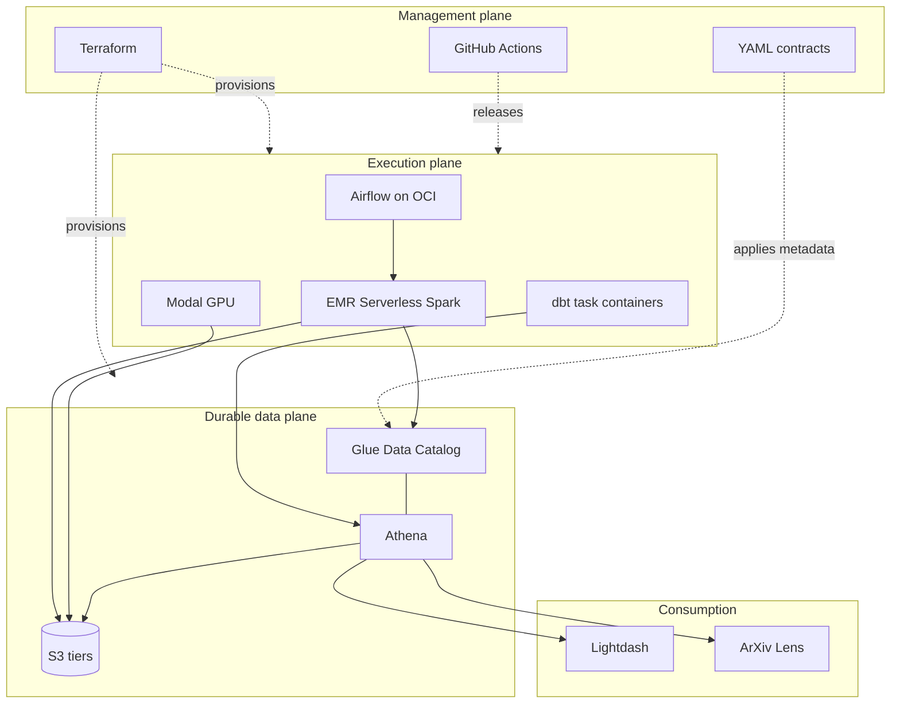

Mini Lakehouse separates control-plane decisions from data-plane execution. Terraform provisions
cloud resources, YAML contracts define catalog intent, compute engines write data, and Airflow
coordinates work without becoming a data source of truth.

## Data layers

- **Landing** preserves replayable source records and source lineage. A source owns its raw capture
  and landing tables.
- **Curated** publishes canonical, validated products through deterministic merges or bounded
  replacement.
- **Analytics** contains consumer-owned dbt marts for Engineering and Research.

AWS is the durable boundary. OCI services can be rebuilt from Terraform, immutable releases,
Secrets Manager, Parameter Store, and PostgreSQL backups. Netdata history and optional SigNoz
telemetry are operational evidence, not durable business data.

## Network topology

The OCI host has outbound internet access and no public ingress. Tailscale is the administrative
path. Cloudflare Tunnel and Access expose Airflow, Lightdash, ArXiv Lens, and Netdata to approved
users. The dormant SigNoz hostname becomes useful only during an explicitly started diagnostics
session. The documentation site is different: it is a public static Cloudflare asset deployment and
does not traverse OCI or the tunnel.
