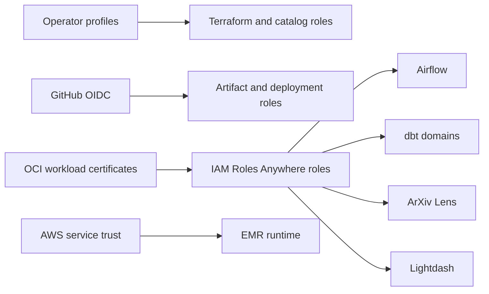

## Responsibility matrix

| Concern                      | Canonical owner                              | Must not own                                      |
| ---------------------------- | -------------------------------------------- | ------------------------------------------------- |
| Cloud resources and IAM      | Terraform                                    | Secret values, Glue tables, schedules, dbt models |
| Landing and curated metadata | YAML contracts and PyIceberg catalog control | Data transformation SQL                           |
| Landing and curated writes   | EMR Spark jobs                               | Glue schema evolution                             |
| OCR publication              | Local OCR CLI and Modal worker               | Airflow scheduling or OCI service state           |
| Analytics tables             | dbt                                          | Source ingestion and curated contracts            |
| BI semantics and content     | Lightdash project files                      | dbt table ownership                               |
| Orchestration                | Airflow                                      | Business data or fallback storage                 |
| Infrastructure health        | Netdata native collectors and Health         | Workflow success criteria or durable logs         |
| On-demand traces/log search  | SigNoz and OpenTelemetry Collector           | Always-on infrastructure monitoring               |

## Identity model

No workload mounts a shared AWS credentials directory. OCI workloads receive only their own
certificate, private key, and `credential_process` configuration. GitHub Actions uses OIDC and
short-lived STS credentials; it stores no AWS access key.

## Permission shape

- Airflow can submit and inspect the owned EMR application and write its S3 task logs; it cannot
  read lakehouse data.
- EMR owns landing and curated data-plane access.
- Each dbt domain reads only its curated inputs and manages only its analytics database and prefix.
- ArXiv Lens reads curated ArXiv data and writes only its Athena results.
- Lightdash reads analytics databases and owns its application bucket and query results.
- The services deployer pulls reviewed images and reads connector material, but cannot read
  application secrets or data.

See [Infrastructure](/docs/capabilities/infrastructure) for provisioning and
[Storage and catalog](/docs/reference/storage-catalog) for physical boundaries.
