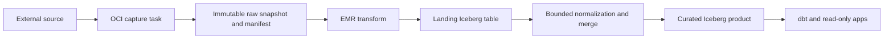

## Purpose and ownership

`lakehouse/` owns data contracts, catalog reconciliation, source-specific Spark jobs, and Iceberg
maintenance. Terraform supplies buckets, KMS, IAM, EMR, and runtime parameters; it does not create
Glue databases or tables.

```text
lakehouse/
├── catalog/       # contract loading and PyIceberg catalog control
├── contracts/     # sources, curated products, and analytics domains
├── ingest/        # bounded OCI source capture and terminal manifests
└── emr/           # Spark jobs, entry points, and immutable release packaging
```

## Processing contract



A source DAG owns one bounded source window. Its OCI task handles the external protocol and publishes
a terminal manifest only after the raw capture is complete. EMR then reads only S3, validates that
manifest and its checksums, and publishes landing and curated tables. Retries converge because raw
snapshots, manifests, landing partitions, merge keys, and publication markers are deterministic.

EMR Serverless has no customer VPC connectivity. This intentionally permits its managed same-Region
AWS endpoints, including S3, Glue, KMS, STS, and managed logs, while leaving external-source access
to the `lakehouse-ingest` task image on OCI.

## Catalog operations

```bash
AWS_PROFILE=tgbao-dev-catalog make catalog-apply
AWS_PROFILE=tgbao-dev-catalog make catalog-validate
```

`catalog-apply` creates missing namespaces and tables, updates safe properties, and permits only
backward-compatible optional-column additions. `catalog-validate` is read-only. Required-column
additions, removals, renames, reordering, type or field-ID changes, partition changes, and location
drift require an explicit migration.

Iceberg identifier fields describe row identity for writers; they are not database uniqueness
constraints.

## Current products

| Source         | Landing database         | Curated database | Schedule                                |
| -------------- | ------------------------ | ---------------- | --------------------------------------- |
| GitHub Archive | `landing_github_archive` | `curated_github` | Daily at 07:30 Asia/Ho_Chi_Minh for T-1 |
| ArXiv OAI      | `landing_arxiv`          | `curated_arxiv`  | Daily at 11:00 Asia/Ho_Chi_Minh for T-1 |

Weekly Iceberg maintenance is submitted by Airflow. It remains a data-plane job rather than catalog
schema mutation.

## Failure modes

- Missing table: apply and validate contracts before rerunning a producer.
- Structural drift: write an explicit migration; do not add an automatic fallback.
- EMR wait: inspect the linked remote job; the Airflow operator is deferrable.
- Partial source publication: rerun the complete bounded window; do not manually append records.
