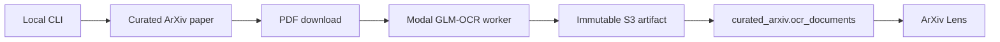

OCR is intentionally small: the operator invokes one local CLI, Modal supplies GPU execution, and a
successful result publishes immutable artifacts plus one current curated row.



## Runtime boundary

- `ocr-engine/src/document_ocr/` owns CLI orchestration, identity, publication, and output shaping.
- `ocr-engine/modal/` owns the Modal app and GPU worker.
- `ocr-engine/config.yaml` pins model repositories, revisions, SDK behavior, and artifact settings.
- The GLM-OCR SDK owns model inference and parsing; local code does not duplicate SDK abstractions.

There is no OCR Airflow DAG, OCI service, ECR repository, provider selection layer, processing-state
table, or Kaggle path.

## Deploy and run

```bash
AWS_PROFILE=tgbao-dev make ocr-modal-deploy
AWS_PROFILE=tgbao-dev make ocr-run ARXIV_ID=2607.00001
```

The operator profile reads the Modal credential secret and accesses the ArXiv data boundary. The
Modal payload contains `token_id` and `token_secret`; it is never committed or passed as a command
literal.

## Publication invariant

`processing_id` binds the paper, PDF content, model revisions, SDK version, and configuration hash.
Artifacts are immutable. `curated_arxiv.ocr_documents` contains only the latest successfully
published document per `arxiv_id`; failures remain console output and do not create lifecycle rows.
