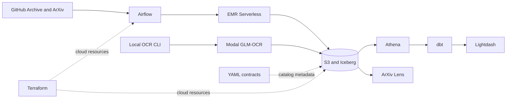

Mini Lakehouse is a production-shaped data platform built to make operational boundaries visible.
AWS owns the durable data plane, a private OCI host runs the small service control plane, and every
deployable capability has an explicit owner, identity, and release path.

<Cards>
  <Card title="Start locally" href="./getting-started">
    Install the toolchain, validate the repository, and learn which commands are
    safe without cloud access.
  </Card>
  <Card title="Understand the architecture" href="./architecture">
    Follow data from public sources through Iceberg, dbt, Lightdash, and the
    read-only application.
  </Card>
  <Card title="Find a capability" href="./capabilities">
    Locate source code, configuration, runtime ownership, and the validation
    boundary for each part.
  </Card>
  <Card title="Operate the platform" href="./operations/deployment">
    Deploy, observe, recover, and diagnose the system without bypassing its
    ownership boundaries.
  </Card>
</Cards>

## Platform flow

## Repository boundaries

| Capability     | Canonical path        | Responsibility                                                                 |
| -------------- | --------------------- | ------------------------------------------------------------------------------ |
| Analytics      | `analytics/`          | dbt transformations, Lightdash semantics, dashboards, and runtime              |
| Automation     | `automation/airflow/` | Scheduling and orchestration only                                              |
| Lakehouse      | `lakehouse/`          | Contracts, Glue/Iceberg catalog control, EMR jobs, and table maintenance       |
| Infrastructure | `infra/`              | Cloud resources, host runtime foundations, identities, and delivery primitives |
| Sysops         | `sysops/`             | Netdata monitoring and the optional SigNoz diagnostics stack                   |
| OCR Engine     | `ocr-engine/`         | Local CLI and scale-to-zero Modal OCR execution                                |
| ArXiv Lens     | `arxiv-lens/`         | Read-only inspection of curated ArXiv and OCR artifacts                        |

<Callout type="info" title="One source of truth">
  Stable operational truth belongs here. Implementation history and future
  proposals remain in `plans/`; executable configuration remains in Make,
  Terraform, Compose, YAML, and application code.
</Callout>
